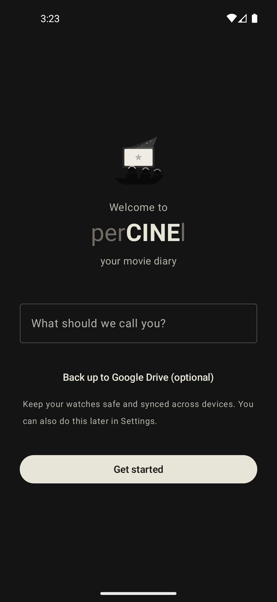
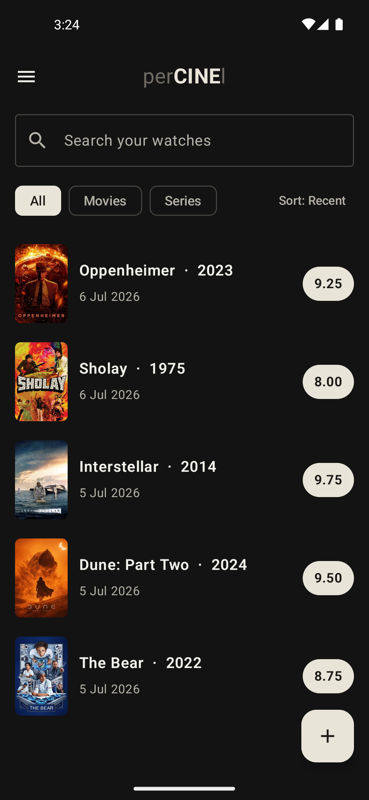
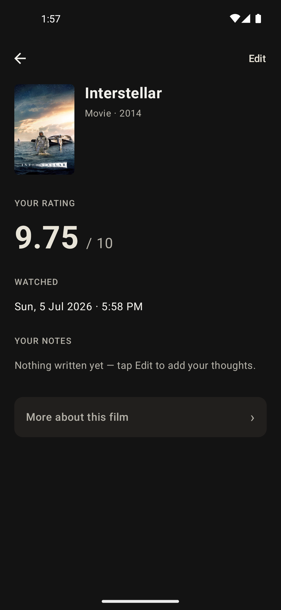
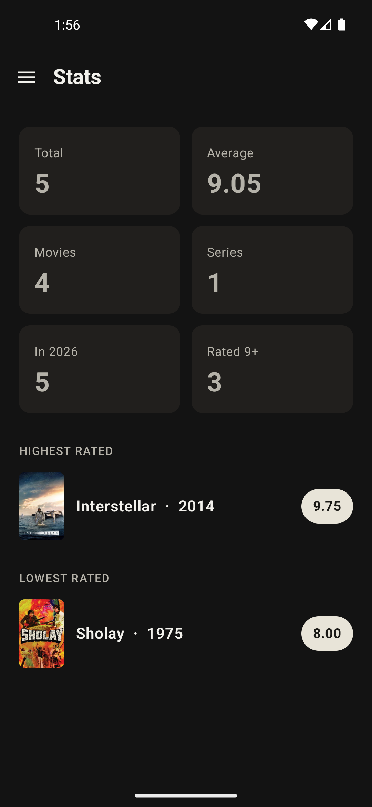

<h1 align="center">perCINEl</h1>

<p align="center">
  <b>The movie &amp; series diary you actually own.</b><br>
  No account. No backend. Sync to your own Google Drive, with your own credentials, in ~2&nbsp;MB.
</p>

<p align="center">
  <a href="https://github.com/gopeshr/percinel/releases/latest"></a>
  
  
</p>

---

## Why this exists

Every other movie tracker asks you to make an account on *their* servers. percinel doesn't have any servers.

- **No sign-up, ever.** Open the app, tell it your name, start logging.
- **Cloud sync is opt-in, and it's yours.** When you turn it on, your diary syncs to a private folder in **your own Google Drive** — not a company's database. Nobody but you can read it.
- **Own it end to end.** Clone the repo, drop in your own TMDB token and your own Google Cloud OAuth client, and you're running a version of percinel where *you* hold every credential. See [Build from source](#build-from-source) — it's genuinely a 15-minute setup, no code changes required.
- **Tiny on purpose.** No ads, no social feed, no gamification, no bloated SDKs. ~1.8 MB, most of it your own watch history.

It's not trying to be Letterboxd or Trakt. It's trying to be the diary app where nobody but you decides what happens to your data.

## 📲 Download

Grab the latest APK from the **[Releases page](https://github.com/gopeshr/percinel/releases/latest)**.

1. Download `percinel-x.y.apk` on your Android phone.
2. Tap it → allow installing from your browser if prompted.
3. Open percinel, set up your profile, and start logging.

> Not on the Play Store (yet) — percinel is distributed as a direct download, so it stays free and installs with your own signing. Tip: point [Obtainium](https://github.com/ImranR98/Obtainium) at this repo to get automatic updates.

> **Want cloud sync to be entirely under your own control?** This prebuilt APK's Drive sync runs on credentials the maintainer registered — fine for casual use, but capped and not something a stranger should have to trust. [Build from source](#build-from-source) instead and it's sync to *your* Drive project, under *your* Google account, forever. No code changes needed.

## Screenshots

| Welcome | Your watches | A watch | Stats |
|:--:|:--:|:--:|:--:|
|  |  |  |  |

## Features

- 🎬 **Log movies & series** with poster, year, and a rating from 1–10 (two decimals), plus the date & time you watched.
- ✍️ **Your take first** — open a title and you see *your* rating and notes, not a Wikipedia dump. Full details are one tap away.
- 📋 **Watchlist** for things you plan to see; mark them watched later.
- 📊 **Stats** — totals, average, this year, rated 9+, highest & lowest — and every card taps through to the exact list.
- 🔎 **Fast search** via TMDB, with **manual entry** for anything not found.
- 📤 **Export** your whole diary to Excel (`.xlsx`) or plain text.
- ☁️ **Optional cloud backup** to your *own* Google Drive — see below.
- 🪶 **Tiny & offline-first** — the whole app is ~1.7 MB and works with no connection.

## Privacy & cloud sync

percinel is **local-first**. Everything you log lives on your device; there are no accounts and no servers.

Backup is **opt-in**. When you turn it on, your diary is stored in a **private, app-only folder in your own Google Drive** (`appDataFolder`) — the developer never sees or stores it. It lets you restore on a new phone or sync across your own devices, merging without ever losing a watch.

See the full [Privacy Policy](https://gopeshr.github.io/percinel/privacy-policy).

## Tech

Native Android, deliberately lean:

- **Kotlin + Jetpack Compose + Material 3**
- **SQLite** via `SQLiteOpenHelper` (no ORM)
- **HttpURLConnection + org.json** for TMDB and Google Drive REST (no Retrofit, no Drive SDK)
- **Coil** for images
- **Google Play Services Auth** only for the native account picker
- R8 + resource shrinking → ~1.7 MB APK

## Build from source

```bash
git clone https://github.com/gopeshr/percinel.git
cd percinel
```

Two secret files are gitignored — create them yourself:

- `app/tmdb.properties`
  ```properties
  TMDB_TOKEN=your_tmdb_v4_read_access_token
  ```
- `keystore.properties` (only needed for release builds) + a `release.keystore`
  ```properties
  storePassword=...
  keyAlias=...
  keyPassword=...
  ```

Then:

```bash
./gradlew :app:assembleDebug      # debug APK
./gradlew :app:assembleRelease    # signed release APK
./gradlew :app:testDebugUnitTest  # run the sync-merge tests
```

That's enough for a fully working app — search, ratings, watchlist, export/import, everything except cloud sync.

### Cloud sync with credentials only you hold

There's no client ID or secret anywhere in this codebase. percinel's Drive sync uses Android's native [`AuthorizationClient`](https://developers.google.com/identity/authorization/android), which resolves *which* Google Cloud project owns the request purely from your app's **package name** and the **SHA-1 fingerprint** of whatever key signed it. Register those two things against your own Google Cloud project, and sync just works — nothing to paste into the app, nothing to configure in code.

1. **Create a Google Cloud project** at [console.cloud.google.com](https://console.cloud.google.com/) — free, no billing required for this.
2. **Enable the Google Drive API** for that project (APIs & Services → Library → search "Google Drive API" → Enable).
3. **Configure the OAuth consent screen** (APIs & Services → OAuth consent screen). Choose **External**, and leave the app in **Testing** — that's fine and free forever for personal use; you just add your own Google account under "Test users."
4. **Get your signing key's SHA-1:**
   ```bash
   ./gradlew signingReport
   ```
   Look for the `SHA1` line under the variant you'll actually install (`debug` while developing, `release` for a real build).
5. **Create an OAuth client ID** (APIs & Services → Credentials → Create Credentials → OAuth client ID → **Android**). Fill in:
   - Package name: `gopesh.percinel` (or whatever you changed `applicationId` to in `app/build.gradle.kts`, if you forked it as your own app)
   - SHA-1 certificate fingerprint: from step 4
6. Build and install. Sign in, tap **Back up & sync** — that's it. Your diary now syncs to a private `appDataFolder` in *your* Drive, reachable only by an app signed with *your* key. percinel only ever requests the `drive.appdata` scope — the narrowest one Google offers, invisible in the regular Drive UI and useless for anything but this.

> One gotcha: Android identifies apps by `applicationId`, not signing key. If you already have the release APK installed and build your own with the same `applicationId` (`gopesh.percinel`) but a different key, installing it will fail with a signature mismatch rather than replacing it. Uninstall the release build first, or change `applicationId` in `app/build.gradle.kts` to keep both side by side.

> Forking for real? The in-app update checker points at `gopeshr/percinel`'s releases — update the URL in `UpdateChecker.kt` to your own repo, or it'll offer you the maintainer's builds.

## Attribution

This product uses the **TMDB API** but is not endorsed or certified by TMDB.

<sub>Movie & series data and images from <a href="https://www.themoviedb.org/">The Movie Database</a>.</sub>
